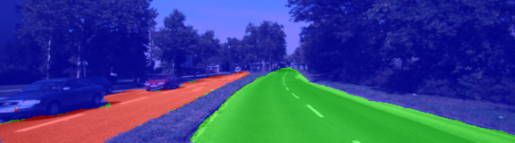
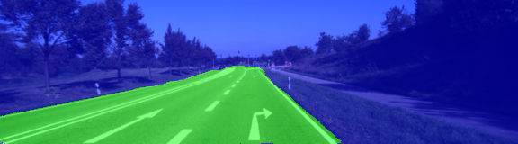
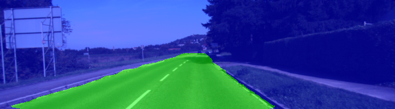
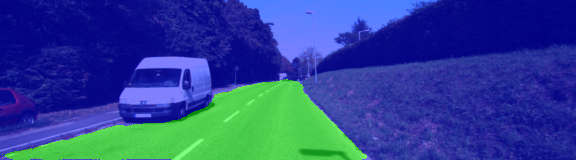
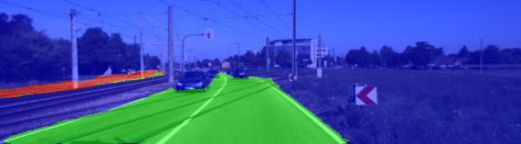
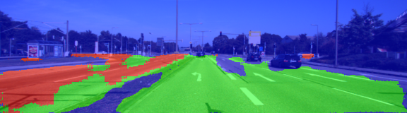
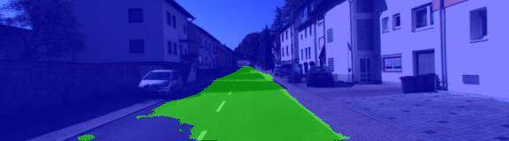

# Semantic Segmentation

### Introduction
In this project, we build a Fully Convolutional Network (FCN) to label pixels on set of images, where we need to identify the road.

### Architecture
We use a Fully Convolutional Network, specifically the FCN-8, developed at Berkeley. A FCN consist in an encoder, in this case VGG16, which extracts the features from the image, then the decoder upsamples this features, getting as output an image of the same size as the input. For the upsampling we use transposed convolutional layers.

To improve the performance we use skip layers, meaning that additionally to the final output of the encoder, we use the information of layers 3 and 4 of VGG.

### Hyperparameters

After some trial and error, a learning rate of 0.0008 seemed to work well for the Adam Optimizer. For keep_prob I used 0.5, I set batch_size to 6 and trained for 50 epochs. More epochs lead to worse results due to overfitting.

### Results

With the above settings, I achieved decent results identifying the road, although the network had problems with heavy shades, such us when entering a tunnel. To improve this I added some augmentaion for contrast and brightness on the training dataset.

Without augmentation:


With augmentation:


The helper functions provided were suited for two classes: road and no road. On the other hand, the KITTI dataset includes three classes: main road, secondary road and no road, I modified the helper functions to accommodate the three classes. The net works worse on secondary roads, but it's still able to identify some of them.

Below you can find some examples of the final results.

Good examples:











Not so good examples:





Overall, the performance is good, although on some images it still has some problems with shades and mixes both types of roads.

## Original README
### Introduction
In this project, you'll label the pixels of a road in images using a Fully Convolutional Network (FCN).

### Setup
##### Frameworks and Packages
Make sure you have the following is installed:
 - [Python 3](https://www.python.org/)
 - [TensorFlow](https://www.tensorflow.org/)
 - [NumPy](http://www.numpy.org/)
 - [SciPy](https://www.scipy.org/)
##### Dataset
Download the [Kitti Road dataset](http://www.cvlibs.net/datasets/kitti/eval_road.php) from [here](http://www.cvlibs.net/download.php?file=data_road.zip).  Extract the dataset in the `data` folder.  This will create the folder `data_road` with all the training a test images.

### Start
##### Implement
Implement the code in the `main.py` module indicated by the "TODO" comments.
The comments indicated with "OPTIONAL" tag are not required to complete.
##### Run
Run the following command to run the project:
```
python main.py
```
**Note** If running this in Jupyter Notebook system messages, such as those regarding test status, may appear in the terminal rather than the notebook.

### Submission
1. Ensure you've passed all the unit tests.
2. Ensure you pass all points on [the rubric](https://review.udacity.com/#!/rubrics/989/view).
3. Submit the following in a zip file.
 - `helper.py`
 - `main.py`
 - `project_tests.py`
 - Newest inference images from `runs` folder  (**all images from the most recent run**)
 
 ## How to write a README
A well written README file can enhance your project and portfolio.  Develop your abilities to create professional README files by completing [this free course](https://www.udacity.com/course/writing-readmes--ud777).
